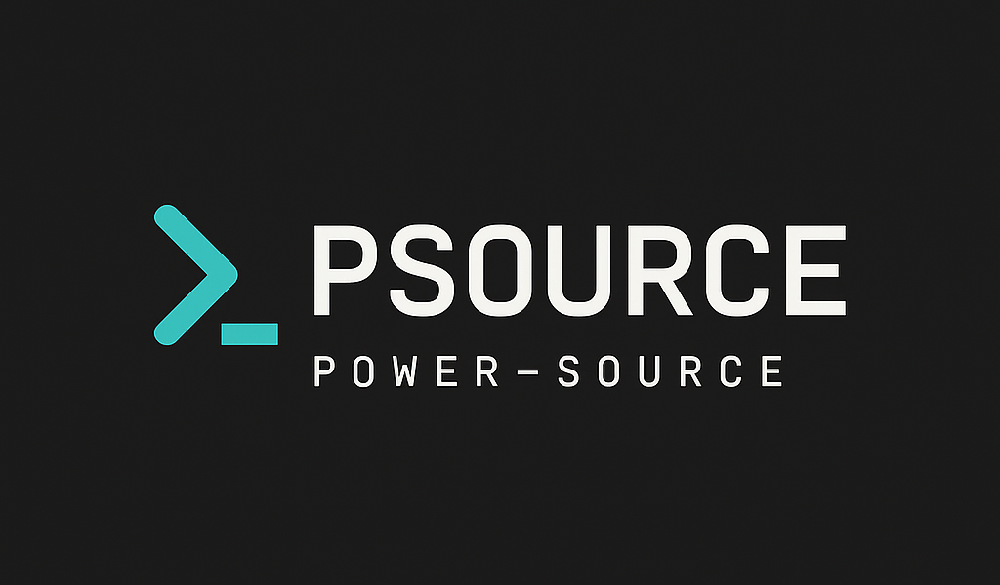

[Deutsch](README.md) | **English**

[](readme.txt)


[](https://www.gnu.org/licenses/gpl-2.0.html)

<div align="center">
  

  <h1>PSOURCE Manager</h1>
  <p><strong>Your central cockpit for the entire PSOURCE ecosystem.</strong></p>
  <p>Install, update and manage all PSOURCE plugins and themes directly from the ClassicPress dashboard – including multisite tools, permission management and an embedded PSOURCE portal.</p>
  <p><a href="https://psource.eimen.net/wiki/psource-manager-dokumentation/">Documentation</a> · <a href="https://github.com/Power-Source/ps-update-manager/issues">Report a bug</a> · <a href="https://psource.eimen.net/">PSOURCE</a></p>
</div>

---

## More than an updater

**PSOURCE Manager** is the central control point for all PSOURCE plugins and themes on a ClassicPress installation – whether single site or multisite network. Instead of maintaining every product individually, everything runs through one dashboard: discover, install, update, assign permissions and manage network tools.

The plugin automatically scans the installation for official PSOURCE products (whitelisted via a signed manifest), pulls updates directly from the GitHub releases of the respective repositories, and integrates seamlessly with the native ClassicPress update UI.

## Highlights

| Area | What PSOURCE Manager brings |
| --- | --- |
| **Dashboard** | Stats on installed products, available updates and active plugins/themes, quick access to catalog, tools and settings |
| **PSOURCE Catalog** | Searchable overview of all official PSOURCE plugins & themes with category filters, badges (page builder, child theme, template) and one-click installation from GitHub releases |
| **Update Manager** | Detects new versions automatically via GitHub releases, plugs into the regular ClassicPress update lists (including the native auto-update toggle), plugin info popup with changelog |
| **Daily auto-scan** | A WP-Cron job checks daily for newly installed products and available updates, no manual click required |
| **Network tools** | Default theme for new blog registrations, per-subsite multisite privacy levels including network sync, terms of service (TOS) at registration |
| **PSOURCE Portal** | Live view of psource.eimen.net directly in the admin area, with quick links to wiki, DEV news and forum |
| **Permission management** | Granular capabilities per role: dashboard access, view catalog, check updates, install/update products, manage plugins/themes, network tools, TOS settings |
| **Recommendations** | Shows PSOURCE products that work well together ("Extend your possibilities with …"), based on an official compatibility manifest |
| **Multilingual** | Fully translatable via standard WordPress/ClassicPress i18n, German as the source language, English already included |
| **Multisite-first** | Works in the network admin, supports both network-wide and per-site activation depending on the product |

## Modular by design

Under **PS MANAGER → Tools** you'll find standalone network tools that can be used independently of each other:

| Tool | Function |
| --- | --- |
| `Default Theme` | Defines which theme is automatically activated for new blog registrations, including recommendations for PSOURCE themes |
| `Multisite Privacy` | Controls available privacy levels (public, private, password protected, members only, …) for subsites as well as network-wide synchronization |
| `Terms of Service (TOS)` | Configures the acceptance requirement and text of the terms of service at registration – globally, with subsite override, or fully per subsite |

There's also a fine-grained permission system under **PS MANAGER → Settings**, letting you allow or block every single feature of the plugin per user role.

## Quick start

### Requirements

- A running ClassicPress installation (2.7.0 or later)
- PHP 7.4 or newer
- For update checks: outbound HTTPS connections to the GitHub API must be allowed

### Installation

1. Upload the `ps-update-manager` folder to `wp-content/plugins/` or install the plugin via your usual package manager.
2. Activate **PSOURCE Manager** in the plugins screen (network-wide activation is recommended for multisite).
3. The dashboard is then available under **PS MANAGER** in the admin menu.
4. Open **PS MANAGER → PSOURCE Catalog** to discover and install further official PSOURCE plugins and themes.
5. Adjust the permissions per role under **PS MANAGER → Settings** if needed.

## How updates work

1. The product scanner detects installed PSOURCE plugins/themes based on an official manifest (whitelist, no third-party products).
2. For every detected product, the latest GitHub release version is checked and compared against the installed version.
3. If a newer version is available, it appears exactly like any other update in the ClassicPress update lists (plugins, themes, `Updates` overview) – including the native auto-update option.
4. A daily WP-Cron job keeps the product list and update status up to date automatically; you can also sync manually at any time via **"Check for updates"** in the dashboard.
5. Updates can be triggered individually or as a batch directly from the PSOURCE Manager dashboard.

## Built for multisite

In the network admin area, PSOURCE Manager offers additional capabilities:

- Network-wide or per-site activation depending on the product (`Network: required` or `PS Network: flexible`)
- Central control of the default theme, privacy levels and registration TOS for all subsites
- Emergency synchronization to bring the privacy settings of all subsites back to a consistent state
- Permissions that apply network-wide to all sites

## Security

- Only products from the official, versioned PSOURCE manifest are detected and updated – no arbitrary third-party repos
- Nonces and capability checks for all write-related AJAX actions (installation, activation, update, settings)
- Granular role/permission system instead of a blanket "admin can do everything"
- GitHub release downloads go through the regular ClassicPress upgrader flow

Please don't disclose security-relevant findings publicly. Instead, use the contact options on [PSOURCE](https://psource.eimen.net/) or open a confidential GitHub issue.

## For other plugin developers

Other PSOURCE plugins can register themselves with the manager to benefit from update detection, catalog listing and the permission system:

```php
add_action( 'ps_update_manager_init', function( $manager ) {
    $manager->register_product( array(
        'slug'    => 'my-plugin',
        'name'    => 'My Plugin',
        'version' => '1.0.0',
        'type'    => 'plugin',
        'file'    => __FILE__,
        'github_repo' => 'Power-Source/my-plugin',
    ) );
} );
```

More details and examples can be found in [`docs/PLUGIN-INTEGRATION.md`](docs/PLUGIN-INTEGRATION.md) and in the [`examples/`](examples/) folder.

### Project structure

```text
includes/
  class-admin-dashboard.php      Dashboard, catalog, portal, settings (admin UI)
  class-product-scanner.php      Detection of installed PSOURCE products
  class-product-registry.php     Central product registry
  class-update-checker.php       GitHub-based update detection & ClassicPress integration
  class-github-api.php           Communication with the GitHub API
  class-dependency-manager.php   Recommendations for compatible PSOURCE products
  class-settings.php             Permission management
  class-tool-manager.php         Registration of the network tools
  tools/                         Default theme, multisite privacy, registration TOS
  products-manifest.php          Official PSOURCE product list (whitelist)
assets/                          Admin CSS/JS for dashboard and catalog
docs/                            Extended documentation
examples/                        Plugin integration examples
languages/                       Translation template (.pot) and language files
```

## Translations

The plugin's source language is German. The [`languages/`](languages/) folder contains an up-to-date `.pot` template as well as a complete English translation (`en_US`). Further languages can be added based on the `.pot` file (e.g. with Poedit) and placed as `ps-update-manager-{locale}.po`/`.mo` in the same folder.

## Contributing

Bug reports, concrete improvement suggestions and pull requests are welcome.

- [GitHub repository](https://github.com/Power-Source/ps-update-manager)
- [Issues and feature ideas](https://github.com/Power-Source/ps-update-manager/issues)
- [PSOURCE](https://psource.eimen.net/)

When reporting bugs, please describe your ClassicPress and PHP version, whether it's a multisite installation, and the steps to reproduce the behavior.

## License

PSOURCE Manager is free software under the **GNU General Public License, Version 2 or later**. See the [license](https://www.gnu.org/licenses/gpl-2.0.html) for details.

---

<div align="center">
  Built by <a href="https://psource.eimen.net/">PSOURCE</a> for a ClassicPress ecosystem that can be managed centrally.
</div>
